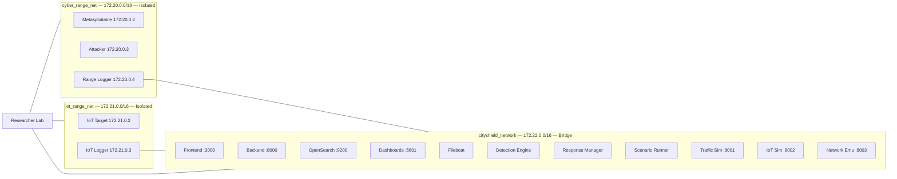
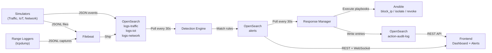
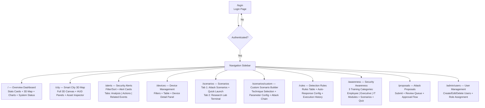
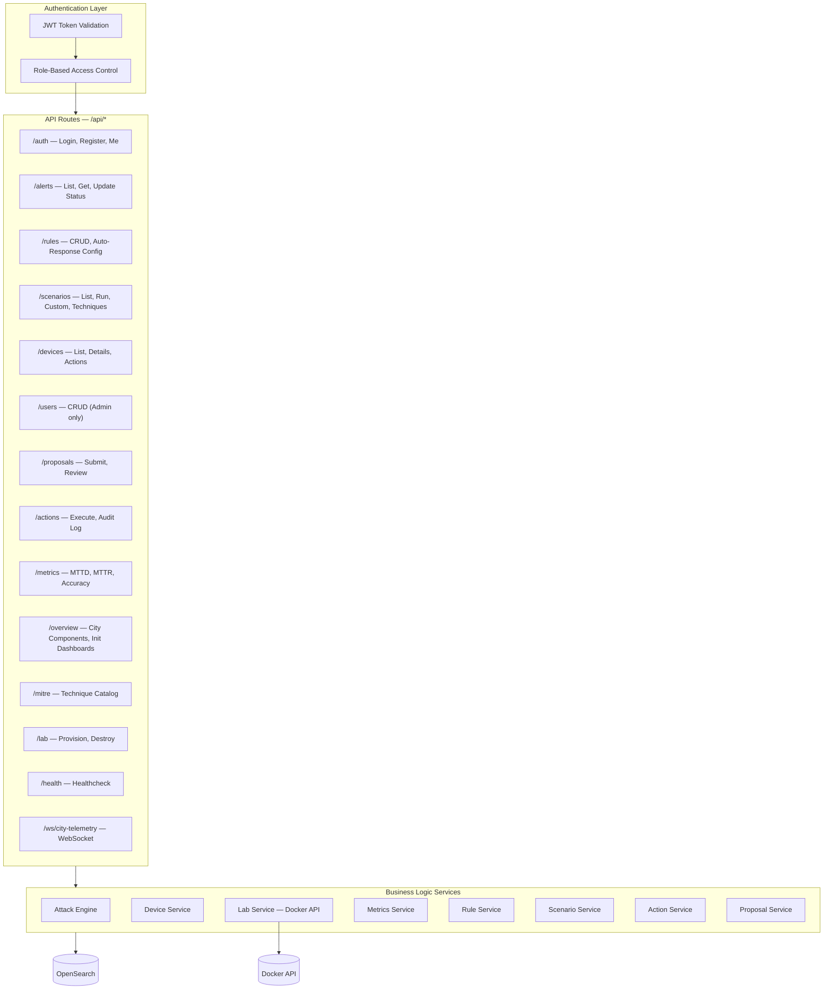
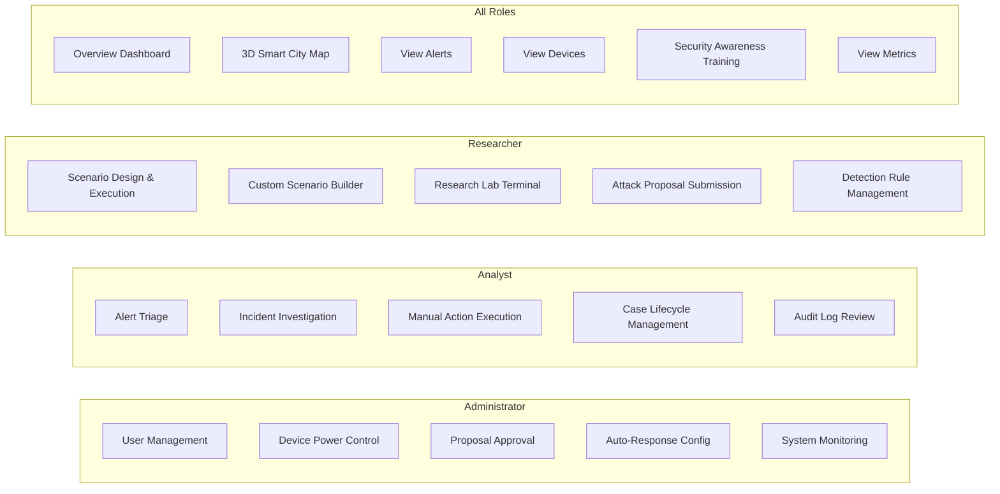
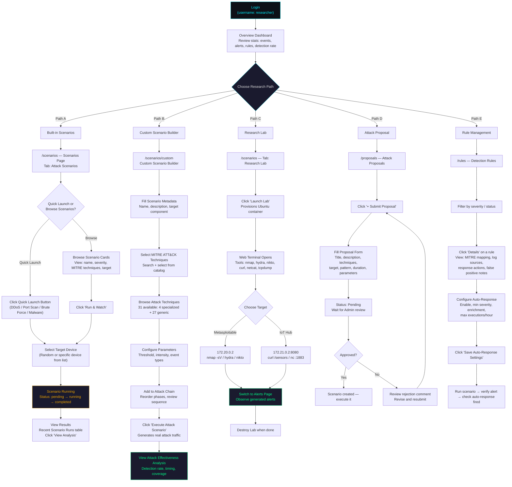
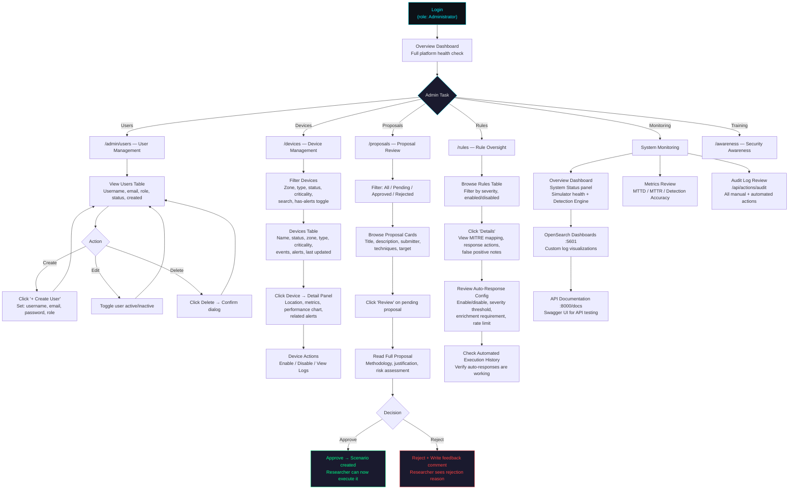

# CityShield — Platform Structure & Role-Based Workflows

**Smart City Cyber Range Platform**
**Version 1.0 — April 2026**

---

## Table of Contents

1. [Platform Overview](#1-platform-overview)
2. [Full System Architecture](#2-full-system-architecture)
   - 2.1 [Architecture Diagram](#21-architecture-diagram)
   - 2.2 [Module Descriptions](#22-module-descriptions)
   - 2.3 [Network Topology](#23-network-topology)
   - 2.4 [Data Flow Pipeline](#24-data-flow-pipeline)
3. [Platform Modules & Connections](#3-platform-modules--connections)
   - 3.1 [Frontend Modules Map](#31-frontend-modules-map)
   - 3.2 [Backend Services Map](#32-backend-services-map)
4. [Role Access Model](#4-role-access-model)
5. [Researcher Workflow](#5-researcher-workflow)
   - 5.1 [Researcher Workflow Diagram](#51-researcher-workflow-diagram)
   - 5.2 [Step-by-Step Walkthrough](#52-step-by-step-walkthrough)
6. [Analyst Workflow](#6-analyst-workflow)
   - 6.1 [Analyst Workflow Diagram](#61-analyst-workflow-diagram)
   - 6.2 [Step-by-Step Walkthrough](#62-step-by-step-walkthrough)
7. [Administrator Workflow](#7-administrator-workflow)
   - 7.1 [Administrator Workflow Diagram](#71-administrator-workflow-diagram)
   - 7.2 [Step-by-Step Walkthrough](#72-step-by-step-walkthrough)

---

## 1. Platform Overview

CityShield is a containerized smart city cyber range platform built for cybersecurity training, threat detection evaluation, and automated incident response research. It simulates real smart city infrastructure — traffic management systems, IoT sensor networks, and enterprise network components — and provides a complete environment for generating attacks, detecting threats, and executing response actions.

The platform serves three distinct user roles, each with a dedicated operational workflow:

| Role | Purpose |
|---|---|
| **Administrator** | Platform governance — manages users, devices, proposals, auto-response policies, and system health |
| **Analyst** | Defensive operations — monitors alerts, investigates incidents, executes response actions, manages case lifecycle |
| **Researcher** | Offensive research — designs attack scenarios, runs penetration tests, submits proposals, manages detection rules |

---

## 2. Full System Architecture

### 2.1 Architecture Diagram

```mermaid
flowchart TB
    subgraph FRONTEND["Frontend — React 18 + TypeScript + Vite"]
        FE_LOGIN[Login Page]
        FE_DASH[Overview Dashboard]
        FE_CITY[3D Smart City Map]
        FE_ALERTS[Alerts Page]
        FE_RULES[Rules Page]
        FE_SCENARIOS[Scenarios Page]
        FE_CUSTOM[Custom Scenario Builder]
        FE_DEVICES[Device Management]
        FE_USERS[User Management]
        FE_PROPOSALS[Attack Proposals]
        FE_AWARENESS[Security Awareness]
        FE_LAB[Research Lab Terminal]
    end

    subgraph BACKEND["Backend — FastAPI + JWT Auth + RBAC"]
        API_AUTH[Auth Routes]
        API_ALERTS[Alerts API]
        API_RULES[Rules API]
        API_SCENARIOS[Scenarios API]
        API_DEVICES[Devices API]
        API_USERS[Users API]
        API_PROPOSALS[Proposals API]
        API_ACTIONS[Actions API]
        API_METRICS[Metrics API]
        API_MITRE[MITRE API]
        API_LAB[Lab Service]
        API_WS[WebSocket Server]
    end

    subgraph DATASTORE["Data Store — OpenSearch 2.11"]
        IDX_TRAFFIC[logs-traffic]
        IDX_IOT[logs-iot]
        IDX_NETWORK[logs-network]
        IDX_ALERTS[alerts]
        IDX_RULES[rules]
        IDX_SCENARIOS[scenarios]
        IDX_RUNS[scenario_runs]
        IDX_USERS[users]
        IDX_ASSETS[city-assets]
        IDX_AUDIT[action-audit-log]
        IDX_PROPOSALS[attack-proposals]
    end

    subgraph PROCESSING["Processing Layer"]
        DET[Detection Engine<br/>25 YAML Rules]
        RESP[Response Manager<br/>Ansible Playbooks]
        RUNNER[Scenario Runner]
    end

    subgraph SIMULATORS["Simulators"]
        SIM_TRAFFIC[Traffic Simulator :8001]
        SIM_IOT[IoT Simulator :8002]
        SIM_NET[Network Emulator :8003]
    end

    subgraph CYBER_RANGE["Cyber Range Network — 172.20.0.0/16"]
        META[Metasploitable2<br/>172.20.0.2]
        ATTACKER[Attacker Container<br/>172.20.0.3]
        RANGE_LOG[Range Logger<br/>172.20.0.4]
    end

    subgraph IOT_RANGE["IoT Range Network — 172.21.0.0/16"]
        IOT_TARGET[IoT Sensor Hub<br/>172.21.0.2<br/>HTTP :8080 / TCP :1883]
        IOT_LOG[IoT Range Logger<br/>172.21.0.3]
    end

    FILEBEAT[Filebeat — Log Shipper]
    DASHBOARDS[OpenSearch Dashboards :5601]
    LAB_CONTAINER[Researcher Lab Container<br/>Ubuntu + Security Tools]

    %% Frontend to Backend
    FRONTEND -->|REST /api/*| BACKEND
    API_WS -->|WebSocket /ws/city-telemetry| FE_CITY
    API_WS -->|WebSocket /ws/city-telemetry| FE_DASH

    %% Backend to OpenSearch
    BACKEND -->|Read/Write| DATASTORE

    %% Processing
    DET -->|Query logs-*| DATASTORE
    DET -->|Write alerts| IDX_ALERTS
    RESP -->|Poll alerts| IDX_ALERTS
    RESP -->|Write audit| IDX_AUDIT
    RUNNER -->|Poll scenario_runs| IDX_RUNS

    %% Simulators
    RUNNER -->|HTTP commands| SIM_TRAFFIC
    RUNNER -->|HTTP commands| SIM_IOT
    RUNNER -->|HTTP commands| SIM_NET
    SIM_TRAFFIC -->|Write events| IDX_TRAFFIC
    SIM_IOT -->|Write events| IDX_IOT
    SIM_NET -->|Write events| IDX_NETWORK

    %% Filebeat
    SIM_TRAFFIC -->|JSONL files| FILEBEAT
    SIM_IOT -->|JSONL files| FILEBEAT
    SIM_NET -->|JSONL files| FILEBEAT
    RANGE_LOG -->|JSONL captures| FILEBEAT
    IOT_LOG -->|JSONL captures| FILEBEAT
    FILEBEAT -->|Ship logs| DATASTORE

    %% Dashboards
    DASHBOARDS -->|Visualize| DATASTORE

    %% Lab
    API_LAB -->|Docker API| LAB_CONTAINER
    LAB_CONTAINER -.->|Access| META
    LAB_CONTAINER -.->|Access| IOT_TARGET

    %% Cyber Range
    RANGE_LOG -->|tcpdump| META
    RANGE_LOG -->|tcpdump| ATTACKER
    IOT_LOG -->|tcpdump| IOT_TARGET

    %% Resp actions
    RESP -->|Ansible block_ip| CYBER_RANGE
    RESP -->|Ansible isolate_service| SIMULATORS
```



The diagram above shows the complete CityShield architecture. All services communicate through the main `cityshield_network` (172.22.0.0/16). The two training networks — `cyber_range_net` and `iot_range_net` — are isolated with the Docker `internal: true` flag to prevent external routing.

### 2.2 Module Descriptions

| Module | Technology | Role |
|---|---|---|
| **Frontend** | React 18, TypeScript, Vite, React Three Fiber | User interface with 3D visualization, served via nginx on port 3000 |
| **Backend API** | Python 3.11, FastAPI, JWT (HS256), bcrypt | REST API + WebSocket, RBAC enforcement, business logic, port 8000 |
| **OpenSearch** | OpenSearch 2.11.1 | Sole data store — 11 indices for logs, alerts, rules, users, audit |
| **Detection Engine** | Python, YAML rules | Polls log indices every 30s, evaluates 25 rules, writes alerts |
| **Response Manager** | Python, Ansible | Polls alerts, validates auto-response conditions, executes playbooks |
| **Scenario Runner** | Python | Polls scenario_runs every 5s, sends HTTP commands to simulators |
| **Traffic Simulator** | Python, FastAPI | Generates traffic management events on port 8001 |
| **IoT Simulator** | Python, FastAPI | Generates IoT sensor events on port 8002 |
| **Network Emulator** | Python, FastAPI | Generates network infrastructure events on port 8003 |
| **Metasploitable2** | Pre-built VM image | Vulnerable training target at 172.20.0.2 |
| **Attacker Container** | Kali Linux tools | Offensive tools container at 172.20.0.3 |
| **IoT Target** | Python, FastAPI | IoT sensor hub with HTTP and MQTT-like endpoints at 172.21.0.2 |
| **Range Loggers** | Python, tcpdump | Packet capture on training networks, output to JSONL |
| **Filebeat** | Elastic Filebeat 7.17 | Ships JSONL logs from shared volume to OpenSearch |
| **Research Lab** | Docker API, Ubuntu | Per-user ephemeral container with nmap, hydra, nikto, netcat |
| **OpenSearch Dashboards** | OpenSearch Dashboards 2.11 | Log analysis and custom visualization on port 5601 |

### 2.3 Network Topology



The Range Logger and IoT Range Logger bridge between their isolated networks and the main network, forwarding captured traffic to Filebeat. The Researcher Lab container is the only dynamic component connected to all three networks, giving researchers direct access to both training targets.

### 2.4 Data Flow Pipeline



Events flow left to right: simulators produce events → OpenSearch stores them → Detection Engine evaluates rules → alerts are created → Response Manager acts → audit trail is recorded. The frontend reads from every stage through the Backend API.

---

## 3. Platform Modules & Connections

### 3.1 Frontend Modules Map



Each box represents a frontend route. The navigation sidebar appears on every page after login and provides access to all modules based on the user's role.

**Navigation visibility by role:**

| Nav Item | Route | Admin | Analyst | Researcher |
|---|---|---|---|---|
| Dashboard | `/` | Visible | Visible | Visible |
| Smart City | `/city` | Visible | Visible | Visible |
| Alerts | `/alerts` | Visible | Visible | Visible |
| Devices | `/devices` | Visible | Visible | Visible |
| Scenarios | `/scenarios` | Visible | Visible | Visible |
| Rules | `/rules` | Visible | Visible | Visible |
| Awareness | `/awareness` | Visible | Visible | Visible |
| Proposals | `/proposals` | Visible | Hidden | Visible |
| Users | `/admin/users` | Visible | Hidden | Hidden |

### 3.2 Backend Services Map



Every request flows through JWT validation, then role-based access checks, then reaches the appropriate route handler. Route handlers call business logic services, which interact with OpenSearch for persistence.

---

## 4. Role Access Model



Each role has exclusive capabilities (top three boxes) and shares common read-access modules (bottom box). The platform enforces these boundaries through backend RBAC decorators — unauthorized API calls return HTTP 403.

---

## 5. Researcher Workflow

### 5.1 Researcher Workflow Diagram



### 5.2 Step-by-Step Walkthrough

#### Step 1 — Login

The Researcher opens `http://localhost:3000` and is redirected to `/login`. They enter their credentials (default: `researcher` / configured password). The backend issues a JWT token, which the frontend stores in `localStorage`. The user is redirected to the Overview Dashboard.

#### Step 2 — Dashboard Orientation

On the Overview page (`/`), the Researcher sees four stats cards — Total Events, Active Alerts, Active Rules, and Detection Rate. Below these cards, a 3D smart city visualization provides a spatial overview of all city components. The Charts section shows an Event Activity timeline and Component Distribution pie chart. The System Status panel shows the health of each simulator and the Detection Engine.

The Researcher uses this page to understand the current platform state before beginning research.

#### Step 3A — Running a Built-in Scenario

1. Navigate to **Scenarios** (`/scenarios`) via the sidebar
2. The page opens on the **Attack Scenarios** tab
3. At the top, four **Quick Launch** buttons allow one-click scenario execution:
   - **DDoS** — floods a target with traffic from multiple sources
   - **Port Scan** — enumerates ports on a target host
   - **Brute Force** — attempts authentication credential guessing
   - **Malware** — simulates malware propagation behavior
4. Below, **Available Scenarios** cards show full scenario details: name, description, severity, MITRE techniques, target component, and duration
5. Click **Run & Watch** on any scenario card
6. A **Target Selection Modal** appears — choose "Random Target" or pick a specific device from the filtered list
7. The scenario enters `pending` status, then transitions to `running` as the Scenario Runner sends HTTP commands to the appropriate simulator(s)
8. The **Recent Scenario Runs** table at the bottom tracks progress and shows the final `completed` or `failed` status
9. Click **View Analysis** on a completed run to review detection results

#### Step 3B — Building a Custom Multi-Phase Scenario

1. From the Scenarios page, click **Custom Scenario Builder** (navigates to `/scenarios/custom`)
2. The page has a two-column layout:
   - **Left column:** Scenario details and technique configuration
   - **Right column:** Attack chain assembly
3. Fill in **Scenario Details**: name, description, target component (Traffic / IoT / Network / Security / Industrial), and optionally a specific target device
4. In the **MITRE ATT&CK Techniques** section, search and select techniques — selected techniques appear as blue badges
5. Browse the **Available Attack Techniques** list — 31 techniques are available:
   - 4 specialized techniques with direct simulator integration (T1046 Network Scan, T1565 IoT Anomaly, T1110 Brute Force, T1498 DDoS)
   - 27 generic techniques with configurable parameters
6. Click a technique to expand its **Parameter Configuration**: boolean toggles, dropdown selects, and integer inputs with min/max validation
7. Click **Add to Attack Chain** — the technique appears in the right column with its sequence number
8. Build multi-phase chains by adding multiple techniques. Use the arrow buttons to reorder phases. Example kill chain:
   - Phase 1: T1046 Network Scanning (Reconnaissance) — 2 min
   - Phase 2: T1110 Brute Force (Credential Access) — 5 min
   - Phase 3: T1570 Lateral Movement (Propagation) — 3 min
   - Phase 4: T1041 Data Exfiltration — 5 min
9. Click **Execute Attack Scenario** — the platform generates real attack traffic
10. On success, a green banner shows the Run ID and offers three actions:
    - **View Attack Effectiveness Analysis** — opens a modal with detection coverage, timing metrics, and rule match details
    - **Create Another Scenario** — resets the builder
    - **Back to Scenarios** — returns to `/scenarios`

#### Step 3C — Using the Research Lab

1. Navigate to **Scenarios** → click the **Research Lab** tab
2. Click **Launch Lab** — the backend provisions an Ubuntu container via the Docker API
3. The container is connected to all three networks: `cityshield_network`, `cyber_range_net`, and `iot_range_net`
4. A **web terminal** opens in the browser with full shell access
5. Pre-installed tools: `nmap`, `hydra`, `nikto`, `curl`, `netcat`, `tcpdump`

**Testing Metasploitable2 (172.20.0.2):**
```bash
nmap -sV 172.20.0.2              # Service version detection
nmap -p- 172.20.0.2              # Full port scan
nmap --script vuln 172.20.0.2    # Vulnerability scripts
hydra -l msfadmin -P wordlist.txt 172.20.0.2 ssh -t 4   # SSH brute force
nikto -h http://172.20.0.2       # Web vulnerability scan
```

**Testing IoT Sensor Hub (172.21.0.2):**
```bash
curl http://172.21.0.2:8080/health     # Health check
curl http://172.21.0.2:8080/sensors    # List sensors
curl http://172.21.0.2:8080/config     # View configuration
nc -v 172.21.0.2 1883                  # Connect to MQTT-like service
```

6. All traffic is captured by the Range Loggers (tcpdump), shipped via Filebeat to OpenSearch, and evaluated by the Detection Engine
7. Switch to the **Alerts** page to observe whether detection rules fired
8. When finished, destroy the lab container through the UI — containers are ephemeral and do not persist data between sessions

#### Step 3D — Submitting an Attack Proposal

1. Navigate to **Proposals** (`/proposals`)
2. Click **+ Submit Proposal**
3. Fill the form:
   - **Title**: descriptive name (e.g., "IoT Firmware Exploitation via MQTT Protocol")
   - **Description**: detailed methodology
   - **Technique IDs**: select from MITRE catalog
   - **Target Component**: which simulator or infrastructure
   - **Attack Pattern**: select pattern type
   - **Duration**: estimated seconds
   - **Parameters**: add custom key-value pairs
4. Click **Submit** — the proposal enters `Pending` status
5. An Administrator reviews the proposal and either approves (creates an executable scenario) or rejects (provides feedback)
6. If rejected, review the rejection comment, revise, and resubmit

#### Step 3E — Managing Detection Rules

1. Navigate to **Rules** (`/rules`)
2. Filter rules by severity (Low / Medium / High / Critical) and status (Enabled / Disabled)
3. Click **Details** on any rule to open the detail modal:
   - **Rule Metadata**: name, description, MITRE technique, severity, response actions, log sources, false positive notes
   - **Auto-Response Configuration**: enable/disable toggle, conditions panel
4. Configure auto-response:
   - **Enable**: turns on automated execution for this rule
   - **Minimum Alert Severity**: only trigger for alerts at or above this level
   - **Require Threat Intelligence Enrichment**: only execute if AbuseIPDB data is present
   - **Max Executions Per Hour**: rate limit (1–100) to prevent runaway automation
5. Click **Save Auto-Response Settings**
6. The **Recent Automated Executions** table shows the history of auto-response actions for this rule
7. Test: run a scenario that should trigger this rule, then verify that an alert was created and the auto-response executed

---

## 6. Analyst Workflow

### 6.1 Analyst Workflow Diagram

```mermaid
flowchart TD
    A_LOGIN["Login<br/>(role: Analyst)"] --> A_DASH["Overview Dashboard<br/>Check stats: events, active alerts,<br/>detection rate, system status"]
    A_DASH --> A_3D["3D Smart City Map<br/>Visual scan for red/yellow buildings"]
    A_3D --> A_ALERTS["/alerts — Alerts Page"]

    A_ALERTS --> A_FILTER["Apply Filters<br/>Status: Open | Severity: Critical/High<br/>Search by rule or keyword"]
    A_FILTER --> A_LIST["Alert List<br/>Sorted newest first"]
    A_LIST --> A_SELECT["Click Alert to Expand"]

    A_SELECT --> A_TAB1["Tab 1: Analysis"]
    A_SELECT --> A_TAB2["Tab 2: Actions"]
    A_SELECT --> A_TAB3["Tab 3: Related Events"]

    %% Analysis Tab
    A_TAB1 --> A_REVIEW["Review Alert Details<br/>Rule name, severity, source/dest IP,<br/>event count, timestamp"]
    A_REVIEW --> A_MITRE["Read MITRE ATT&CK Context<br/>Technique description, tactic,<br/>investigation steps, related techniques"]
    A_MITRE --> A_ENRICHMENT["Check Enrichment Data<br/>(AbuseIPDB threat intel if available)"]
    A_ENRICHMENT --> A_CLASSIFY{"Classify Alert"}
    A_CLASSIFY -->|True Positive| A_RESPOND["Proceed to Response"]
    A_CLASSIFY -->|False Positive| A_STATUS_FP["Update Status: Resolved<br/>Note for rule tuning"]
    A_CLASSIFY -->|Needs Escalation| A_ESCALATE["Flag for Admin review"]

    %% Related Events Tab
    A_TAB3 --> A_EVENTS["View Related Events Timeline<br/>Raw events that triggered the alert<br/>Source, destination, payload, timestamps"]
    A_EVENTS --> A_CORRELATE["Cross-Reference<br/>Filter alerts by same src_ip or dst_ip<br/>Look for MITRE technique chains"]
    A_CORRELATE --> A_OPENSEARCH["Open in OpenSearch Dashboards<br/>Deep query across all log indices"]
    A_OPENSEARCH --> A_CLASSIFY

    %% Actions Tab
    A_RESPOND --> A_TAB2
    A_TAB2 --> A_ACTIONS["View Available Actions<br/>block_ip | isolate_service | revoke_token"]
    A_ACTIONS --> A_CHOOSE["Select Action to Execute"]
    A_CHOOSE --> A_CONFIRM["Confirmation Dialog<br/>Review: action, target, risk warning<br/>☑ Check risk acknowledgment"]
    A_CONFIRM --> A_EXECUTE["Click 'Confirm'<br/>Action queued → Response Manager executes"]
    A_EXECUTE --> A_MONITOR["Monitor Execution<br/>Status: pending → success/failed"]
    A_MONITOR --> A_DETAILS["Click execution entry<br/>View: playbook output, stdout/stderr,<br/>parameters, timestamps"]
    A_DETAILS --> A_VERIFY{"Action Successful?"}
    A_VERIFY -->|Yes| A_CLOSE["Update Alert Status<br/>Open → Triaged → Resolved"]
    A_VERIFY -->|No| A_RETRY["Review error → Retry or escalate"]
    A_RETRY --> A_CHOOSE

    %% Final
    A_CLOSE --> A_AUDIT["Review Action Audit History<br/>All manual + automated actions logged"]
    A_AUDIT --> A_MAP["Click 'View on Map'<br/>See affected asset in 3D city"]
    A_MAP --> A_NEXT["Return to Alert List<br/>Process next alert"]
    A_NEXT --> A_LIST

    style A_LOGIN fill:#0d1117,stroke:#00f0ff,color:#00f0ff
    style A_CLASSIFY fill:#1a1a2e,stroke:#f0a500,color:#f0a500
    style A_VERIFY fill:#1a1a2e,stroke:#f0a500,color:#f0a500
    style A_CLOSE fill:#1a1a2e,stroke:#00ff88,color:#00ff88
```



### 6.2 Step-by-Step Walkthrough

#### Step 1 — Login and Dashboard Review

The Analyst logs in at `/login` and is directed to the Overview Dashboard. The four stats cards provide an immediate pulse check:

| Card | What to Look For |
|---|---|
| Total Events | Baseline event volume — spikes may indicate active attacks |
| Active Alerts | Count of open alerts — prioritize if high |
| Active Rules | Number of enabled detection rules |
| Detection Rate | Percentage of events that triggered alerts |

The System Status panel shows whether the Traffic Simulator, IoT Sensors, Network Emulator, and Detection Engine are healthy. A red indicator here means an infrastructure issue, not a security event.

#### Step 2 — Visual Scan via 3D Smart City Map

Navigate to **Smart City** (`/city`) for a spatial overview. The 3D map renders each city component as a building:
- **Green** = normal operation
- **Yellow** = warning-level activity
- **Red** = critical alerts detected
- **Building height** = relative event count (taller = more events)

Click any building to open the **Asset Inspector Panel** on the right, showing device name, type, status, event/alert counts, and risk score. Use this to spot affected zones visually before diving into the Alerts page.

#### Step 3 — Alert Triage on the Alerts Page

Navigate to **Alerts** (`/alerts`). The page header shows badge counts for Open and Critical alerts.

**Filtering workflow:**
1. Set **Status** filter to `Open` (new, unprocessed alerts)
2. Set **Severity** filter to `Critical` first, then work down to High, Medium, Low
3. Use the **Search** box to filter by rule name, source IP, or keyword
4. Alerts are sorted newest first by default

**Triage priority:**

| Priority | Filter | Expected Action |
|---|---|---|
| P1 | Critical + Open | Immediate investigation (within 5 min) |
| P2 | High + Open | Prompt investigation (within 15 min) |
| P3 | Medium + Open | Scheduled review (within 1 hour) |
| P4 | Low + Open | Batch review during quiet periods |

#### Step 4 — Deep Investigation

Click an alert to expand it. Three tabs appear:

**Tab 1 — Analysis:**
- **Rule metadata**: which detection rule fired, what severity it assigned
- **MITRE ATT&CK mapping**: technique ID, technique name, tactic category, kill chain phase
- **Threat narrative**: "What Happened" (event description), "Why Dangerous" (threat context), "How to Fix" (remediation steps)
- **Indicators**: IPs, ports, domains, file hashes
- **Severity context**: explains why the severity level was assigned
- **Enrichment data**: if threat intelligence is enabled, shows AbuseIPDB confidence score, abuse categories, and country of origin

**Tab 3 — Related Events:**
- Shows the raw log events that triggered the alert in chronological order
- Each event shows: timestamp, source IP, destination IP, event type, payload details
- Use this to reconstruct exactly what happened, in what order

**Cross-correlation:**
- Go back to the Alerts list and filter by the same `source_ip` to find other attacks from the same actor
- Filter by `destination_ip` to find all attacks targeting the same asset
- Look for MITRE technique chains (e.g., T1046 Recon → T1110 Brute Force → T1570 Lateral Movement) to identify multi-stage attacks
- Click **View in OpenSearch** to open OpenSearch Dashboards with a pre-filtered query for deeper log analysis

#### Step 5 — Response Action Execution

Switch to **Tab 2 — Actions**. Three action cards are displayed:

| Action | Target | Effect |
|---|---|---|
| `block_ip` | Attacker's IP address | Adds iptables rule to drop all traffic |
| `isolate_service` | Compromised Docker container | Stops the container immediately |
| `revoke_token` | Compromised user account | Invalidates the user's JWT session |

**Execution process:**
1. Click **Execute** on the chosen action
2. The **Action Confirmation Dialog** appears:
   - Displays action name, description, and target parameters
   - Shows a risk warning
   - **Required**: check the risk acknowledgment checkbox before confirming
3. Click **Confirm** — the action is queued with `pending` status
4. The Response Manager picks up the action, executes the Ansible playbook, and updates the status to `success` or `failed`
5. The **Action Execution History** table at the bottom of the Actions tab shows all executions for this alert
6. Click any execution entry to open the **Execution Details Modal**: full playbook output (stdout/stderr), parameters, timestamps, and error details if failed

#### Step 6 — Case Closure

After successful response:
1. Use the **Status dropdown** on the alert to change it from `Open` → `Triaged` → `Resolved`
2. Review the complete action history to verify all actions succeeded
3. Click **View on Map** to confirm the affected asset's status has returned to normal in the 3D visualization
4. Click **View Device** to navigate to the Device Management page filtered to the affected asset

#### Step 7 — Ongoing Monitoring

Return to the Alerts list and process the next alert by priority. The Analyst's cycle is continuous:

```
Monitor Dashboard → Spot Alert → Triage → Investigate → Respond → Close → Repeat
```

**Awareness of auto-responses:** Some alerts may already have automated responses executed. Check the Actions tab for entries with `triggered_by: system` — these were executed automatically based on the rule's auto-response configuration.

---

## 7. Administrator Workflow

### 7.1 Administrator Workflow Diagram



### 7.2 Step-by-Step Walkthrough

#### Step 1 — Login and Platform Health Check

The Administrator logs in and reviews the Overview Dashboard for a full platform health check:

| Dashboard Section | What to Verify |
|---|---|
| Stats Cards | Event volume is within normal range; alert count is manageable |
| 3D Smart City Map | No buildings are red (critical) unexpectedly |
| System Status | All four systems show green (Traffic Sim, IoT Sensors, Network Emu, Detection Engine) |
| External Services | OpenSearch Dashboards accessible, API documentation available |

If the Dashboard's **Initialize Dashboards** button is visible, click it to set up default OpenSearch Dashboard visualizations.

#### Step 2 — User Management

Navigate to **Users** (`/admin/users`). This page is exclusive to the Administrator role.

**Creating a new user:**
1. Click **+ Create User**
2. Fill the form:
   - **Username**: unique identifier
   - **Email**: user's email address
   - **Password**: initial password
   - **Role**: select from `Analyst`, `Researcher`, or `Administrator`
   - **Is Active**: checked by default
3. Click **Create** — the user is stored in the OpenSearch `users` index with a bcrypt-hashed password

**Managing existing users:**
- **Enable/Disable**: toggle a user's active status (disabled users cannot log in)
- **Delete**: click Delete → confirm in the dialog (irreversible)
- The table shows: username, email, role (color-coded badge), status, and creation date

#### Step 3 — Device Management

Navigate to **Devices** (`/devices`). The header shows three badge counters: Total devices, Active devices, and Devices with alerts.

**Filtering:**
- **Zone**: filter by city zone (Downtown, Industrial, Residential, etc.)
- **Type**: filter by asset type (traffic_controller, iot_sensor, network_switch, etc.)
- **Status**: Active / Inactive / Maintenance / Decommissioned
- **Criticality**: filter by criticality level
- **Has Alerts**: toggle to show only devices with active alerts
- **Search**: text search across device names

**Device Detail Panel:**
Click any device in the table to open its detail panel:
- Full device identity: name, description, asset type, zone, coordinates
- Current metrics: events count, alerts count, risk score
- Performance chart: historical event/alert data
- Related alerts table: alerts associated with this device
- Action buttons: enable/disable device, view logs

#### Step 4 — Proposal Review

Navigate to **Proposals** (`/proposals`). Use the filter tabs to view proposals by status: All, Pending, Approved, Rejected.

**Reviewing a pending proposal:**
1. Click **Review** on a pending proposal card
2. The review modal shows the full proposal: title, description, techniques, target, attack pattern, parameters
3. Evaluate against these criteria:
   - **Research value**: does the proposal test something meaningful?
   - **Risk containment**: is the attack confined to training networks?
   - **MITRE coverage**: does it test techniques not already covered?
   - **Methodology quality**: is the approach detailed and sound?
4. Write a **Review Comment** (required for rejection, optional for approval)
5. Click **Approve** — the proposal is converted to an executable scenario
6. Or click **Reject** — the researcher sees the rejection comment and can revise

#### Step 5 — Rule Oversight and Auto-Response Configuration

Navigate to **Rules** (`/rules`).

**Rule oversight:**
1. Browse the rules table — 25 rules covering MITRE techniques from T1003 to T1569
2. Toggle rules enabled/disabled as needed
3. Click **Details** to review any rule's MITRE mapping, configured response actions, log sources, and false positive notes

**Auto-response management:**
1. In the rule detail modal, review the **Auto-Response Configuration** section
2. Verify settings are appropriate:
   - Is auto-response enabled for the right rules?
   - Is the minimum severity threshold appropriate? (Critical-only for aggressive actions)
   - Is the enrichment requirement set? (Prevents action on unverified alerts)
   - Is the rate limit reasonable? (Default: 10/hour)
3. Check the **Recent Automated Executions** table to verify auto-responses are firing correctly
4. Adjust settings and click **Save Auto-Response Settings**

#### Step 6 — System Monitoring and Metrics

**Ongoing monitoring workflow:**

| Task | Location | Frequency |
|---|---|---|
| Dashboard health check | Overview (`/`) | Start of each session |
| 3D city visual scan | Smart City (`/city`) | Periodic throughout session |
| Alert volume review | Alerts (`/alerts`) | Continuous |
| Audit log review | `GET /api/actions/audit` | Daily |
| OpenSearch log analysis | Dashboards (`:5601`) | As needed |
| Metrics evaluation | `scripts/compute_metrics.py` or `/api/metrics` | Weekly |

**Key metrics to track:**

| Metric | Formula | Target |
|---|---|---|
| MTTD | Avg(alert timestamp − event timestamp) | Minimize |
| MTTR | Avg(action completion − alert creation) | Minimize |
| Detection Accuracy | True positives / (True positives + False positives) | Maximize |
| Response Success Rate | Successful actions / Total actions | > 95% |
| Rule Coverage | Rules covering MITRE technique / Total MITRE techniques used | Maximize |

**Audit trail verification:**
- Query `GET /api/actions/audit` with filters for date range, execution type, and status
- Verify all automated executions are logging correctly
- Check for failed actions that may need manual intervention
- Use `GET /api/actions/rule/{ruleId}/history` to evaluate per-rule effectiveness

#### Step 7 — Security Awareness Oversight

Navigate to **Awareness** (`/awareness`). While the training content is available to all roles, the Administrator may review it to ensure appropriate training is in place:

| Category | Audience | Quiz Pass Threshold |
|---|---|---|
| Employee Training | General workforce | 70% |
| Executive Training | Management | 75% |
| IT/Security Team | Technical staff | 80% |

Each category includes 4 training modules, interactive scenarios, and a 5-question knowledge assessment.

---

*CityShield — Smart City Cyber Range Platform*
*Platform Structure & Role-Based Workflows Document*
*Version 1.0 — April 2026*
